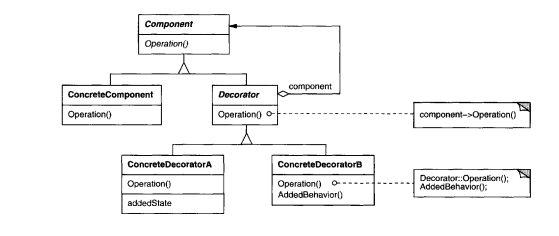

# Patrones

### Catálogo de Patrones de la materia

## Patrones de comportamiento

### Template Method

-   Actores:
    -   Abstract class
    -   Concrete class
-   Estructura: 
    

### Strategy

-   Actores:
    -   Context
    -   Strategy
    -   ConcreteStrategy
-   Estructura: 
    

### State

-   Actores:
    -   Context
    -   State
    -   ConcreteState
-   Estructura: 
    

## Patrones estructurales

### Composite

-   Actores:
    -   Client
    -   Component
    -   Leaf
    -   Composite
-   Estructura: 
    

### Decorator

-   Actores:
    -   Component
    -   Concrete Component
    -   Decorator
    -   Concrete Decorator
-   Estructura: 
    

### Adapter

-   Actores:
    -   Target
    -   Client
    -   Adaptee
    -   Adapter
-   Estructura: 
    

### Proxy

-   Actores:
    -   Subject
    -   Real Subject
    -   Proxy
-   Estructura: 
    

## Patrones creacionales

### Builder

-   Actores
    -   Director
    -   Builder
    -   ConcreteBuilder
    -   Product
-   Estructura: 
    
