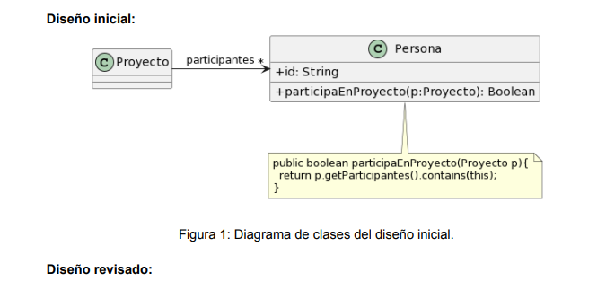
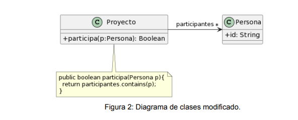

# Refactoring

### Práctica

---

## Ejercicio 1 - Bad Smells

1. _Protocolo de cliente_

    _La clase Cliente tiene el siguiente protocolo. ¿Cómo puede mejorarlo?_

    ```java
    /**
    * Retorna el límite de crédito del cliente.
    */
    protected double lmtCrdt() {
        ...
    }
    /**
    * Retorna el monto facturado al cliente desde la fecha f1 a la fecha f2.
    */
    protected double mtFcE(LocalDate f1, LocalDate f2) {
        ...
    }
    /**
    * Retorna el monto cobrado al cliente desde la fecha f1 a la fecha f2.
    */
    protected double mtCbE(LocalDate f1, LocalDate f2) {
        ...
    }
    ```

    ## _Respuesta:_

    Se debe aplicar Rename Method y Rename Variable:

    ```java
    protected double limiteDeCredito() {
        ...
    }

    protected double montoFacturadoEnPeriodo(LocalDate fechaInicio, LocalDate fechaFin) {
        ...
    }

    protected double montoCobradoEnPeriodo(LocalDate fechaInicio, LocalDate fechaFin) {
        ...
    }
    ```

    De esta manera, ya no se necesitan comentarios, y la función de cada variable es clara a simple vista.

---

2. _Participación en proyectos_

    _Al revisar el siguiente diseño inicial (Figura 1), se decidió realizar un cambio para evitar lo que se consideraba un mal olor. El diseño modificado se muestra en la Figura 2. Indique qué tipo de cambio se realizó y si lo considera apropiado. Justifique su respuesta._

    </br>
    

    ## _Respuesta:_

    El cambio realizado fue Move Method. Es apropiado, ya que con este cambio, las responsabilidades están repartidas de una manera apropiada. Con la solución inicial, el bad smell era Feature Envy, ya que se le pedía al proyecto uno de sus atributos para operar sobre él. De igual manera, haría un Rename Method para que el nombre del método sea personaParticipa, para que sea un poco más claro.

---

3. _Cálculos_

    _Analice el código que se muestra a continuación. Indique qué defectos encuentra y cómo pueden corregirse._

    ```java
    public void imprimirValores() {
        int totalEdades = 0;
        double promedioEdades = 0;
        double totalSalarios = 0;
        for (Empleado empleado : personal) {
            totalEdades = totalEdades + empleado.getEdad();
            totalSalarios = totalSalarios + empleado.getSalario();
        }
        promedioEdades = totalEdades / personal.size();
        String message = String.format("El promedio de las edades es %s y el total de salarios es %s", promedioEdades, totalSalarios);
        System.out.println(message);
    }
    ```

    ## _Respuesta:_

    Se debe realizar
